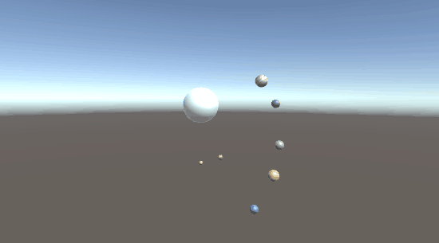
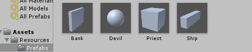
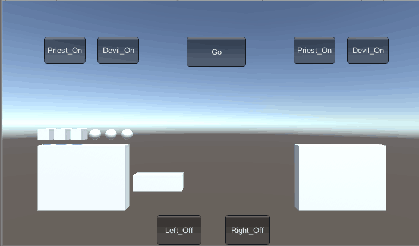

# 简答并用程序验证
## 游戏对象运动的本质是什么？
游戏运动的本质实际上是随着每一帧的改变，物体的坐标进行改变。物体的位置分为绝对位置和相对位置。可以通过修改Transform中的position和rotation属性来控制物体的运动。
## 请用三种方法以上方法，实现物体的抛物线运动。
### 1.用Vector.down和Vector.right分别改变position

  <code>
    
    void Update(){
      this.transform.position += Vector.right * Time.deltatime;
      this.transform.position += Vector.down * Time.deltatime;
    }
    
  </code> 

### 2.声明一个Vector3变量，在该变量中规定向右向下的变换，用该变量改变position

<code>
      
    void Update(){
      Vector3 delta = new Vector3(Time.deltatime, -Time.deltatime, 0);
      this.transform.position += delta;
    }

</code>
    

### 3.使用translate的Translate()方法

<code>
    
    void Update(){
      Vector3 delta = new Vector3(Time.deltatime, -Time.deltatime, 0);
      this.transform.Translate(delta);
    }
    
</code> 

## 写一个程序，实现一个完整的太阳系， 其他星球围绕太阳的转速必须不一样，且不在一个法平面上。

### 代码实现部分

<code>
          
    using System.Collections;
    using System.Collections.Generic;
    using UnityEngine;

    public class NewBehaviourScript : MonoBehaviour {

      public Transform Earth;
      public Transform Mercury;
      public Transform Venus;
      public Transform Jupiter;
      public Transform Saturn;
      public Transform Mars;
      public Transform Uranus;
      public Transform Neptune;
      public Transform Sun;

      // Use this for initialization
      void Start () {
		
	    }
	
	    // Update is called once per frame
	    void Update () {
          Earth.RotateAround(Sun.position, new Vector3(0, 1, 0),50 * Time.deltaTime);
          Mercury.RotateAround(Sun.position, new Vector3(1, 0, 0), 50 * Time.deltaTime);
          Venus.RotateAround(Sun.position, new Vector3(0, 0, 1), 50 * Time.deltaTime);
          Jupiter.RotateAround(Sun.position, new Vector3(1, 1, 0),50 * Time.deltaTime);
          Saturn.RotateAround(Sun.position, new Vector3(0, 1, 1), 50 * Time.deltaTime);
          Mars.RotateAround(Sun.position, new Vector3(1, 0, 1), 50 * Time.deltaTime);
          Uranus.RotateAround(Sun.position, new Vector3(1, 1, 1), 50 * Time.deltaTime);
          Neptune.RotateAround(Sun.position, new Vector3(2, 1, 0), 50 * Time.deltaTime);
      }
    }

</code>

### 效果图

代码部分主要实现了八大行星的公转部分。如果考虑自转也很简单，只要对每个行星添加Rotate（）的方法即可。

# 编程实践
## 列出游戏中提及的事物（Objects）
3个牧师、3个魔鬼、2个河岸、1个小船
## 用表格列出玩家动作表（规则表）

|事件 | 条件|
| --------   | :-----   |
|开船 | 船在开始岸，船在结束岸，船上至少有一个人|
|船的左方下船 | 船靠岸且船左方有人|
|开始岸的牧师上船 | 船在开始岸，船有空位，开始岸有牧师|
|开始岸的魔鬼上船 | 船在开始岸，船有空位，开始岸有魔鬼|
|结束岸的牧师上船 | 船在结束岸，船有空位，结束岸有牧师|
|结束岸的魔鬼上船 | 船在结束岸，船有空位，结束岸有魔鬼|

## 资源预制

## 游戏效果图

